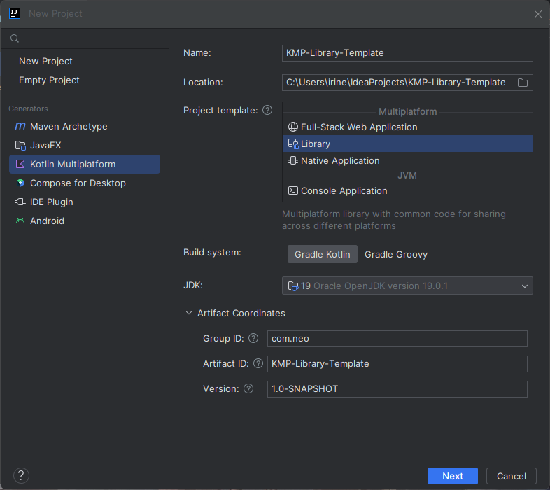

# [Study] KMP Library Template
Creating a Kotlin Multiplatform project using the Library template by Intellij, which automatically implement the `kotlin-multiplatform` plugin, to learn about the structure of a KMP project.

## Case Study
Creating a multiplatform library (JVM, JavaScript, and Native) for encoding strings into base 64.

## Source
- [Create and publish a multiplatform library – tutorial](https://kotlinlang.org/docs/multiplatform-library.html)